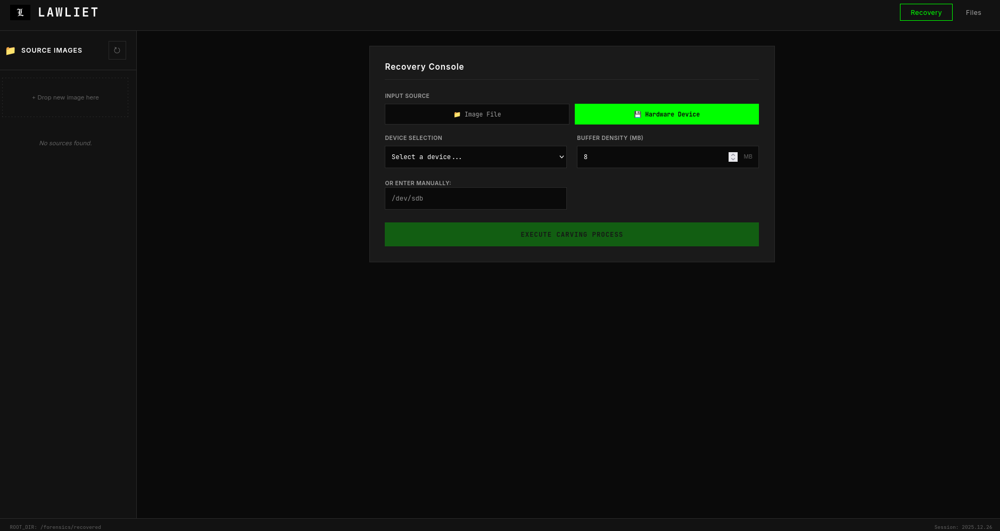

<div align="center">


# LAWLIET // Digital Forensics
### Advanced Signature-Based File Carver & Recovery Engine

[](https://www.python.org/)
[]()
[]()
[]()
[](https://www.linkedin.com/in/nicolas-pauferro-b943a2282/)

**A powerful, extensible forensic tool designed to recover deleted files from disk images through advanced signature analysis.**

[🚀 Getting Started](#getting-started) • [🏗️ Architecture](#architecture) • [🛠️ Features](#features) • [🌐 Web Interface](#web-interface) • [💻 CLI Mode](#cli-mode)

</div>


---

## Features

- 🔍 **Multi-Format Carving**: Recovers JPEG, PNG, PDF, GIF, ZIP, MP4, and Office documents.
- ⚡ **Dual Processing Modes**: Use it as a powerful CLI tool or through a modern web interface.
- 🛡️ **Safe Analysis**: Built-in safety measures to prevent overwriting system drives.
- 📊 **Real-time Monitoring**: Progress tracking and live console output for both modes.
- 🧩 **Extensible Signatures**: Easily add new file types via the signature registry.
- 📁 **Direct Device Support**: Capable of carving directly from hardware devices (e.g., `/dev/sdb`).

---

## Getting Started

### Pre-requisites

- Python 3.7+
- Linux (recommended for hardware device access)

### Installation

1. **Clone the repository**:
   ```bash
   git clone https://github.com/yourusername/lawliet-forensics
   cd lawliet-forensics
   ```

2. **Install dependencies**:
   ```bash
   pip install -r web/requirements.txt
   ```

---

## Usage Modes

Lawliet provides two distinct ways to operate, depending on your forensic workspace requirements.

### 🌐 Web Interface (Recommended)
The modern web interface allows for easy image management, one-click recovery, and file browsing.

1. **Start the server**:
   ```bash
   python3 web/app.py
   ```
2. **Access the dashboard**: Open `http://localhost:5000` in your browser.

<div align="center">
  
  <p><i>The intuitive dashboard for managing forensic tasks</i></p>
</div>

### 💻 CLI Mode
For automated tasks or terminal-based forensic analysis.

```bash
python3 core/lawliet.py "path/to/image" "path/to/output" -b "BUFFER SIZE IN MB"
```
*Options:*
- `-b`: Buffer size in MB (defaults to 8MB). Increasing this can improve speed on systems with high RAM.

---

## Supported File Types

| Type | Extension | Strategy |
|------|-----------|----------|
| **Images** | .jpg, .png, .gif | Header/Footer |
| **Documents** | .pdf, .docx, .pptx | Header/Footer |
| **Archives** | .zip | Structural Carving |
| **Video** | .mp4 | Box Analysis |

---

## Security & Ethics

> [!IMPORTANT]
> This tool is for educational and authorized forensic purposes only.
> **Always** work on a copy of the evidence (create a raw image with dd) rather than the original media whenever possible.

> [!WARNING]
> Direct device access (`/dev/sdX`) usually requires root privileges for reading (`sudo`). Be extremely careful when specifying device paths.

---

<div align="center">
  <p>Made with ❤️ by <b>Nicolas Pauferro</b></p>
  <p><i>Forensic analysis made simple and accessible.</i></p>
</div>
